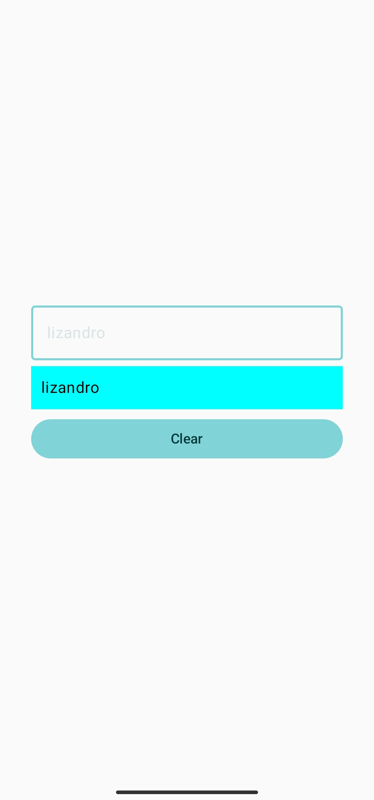
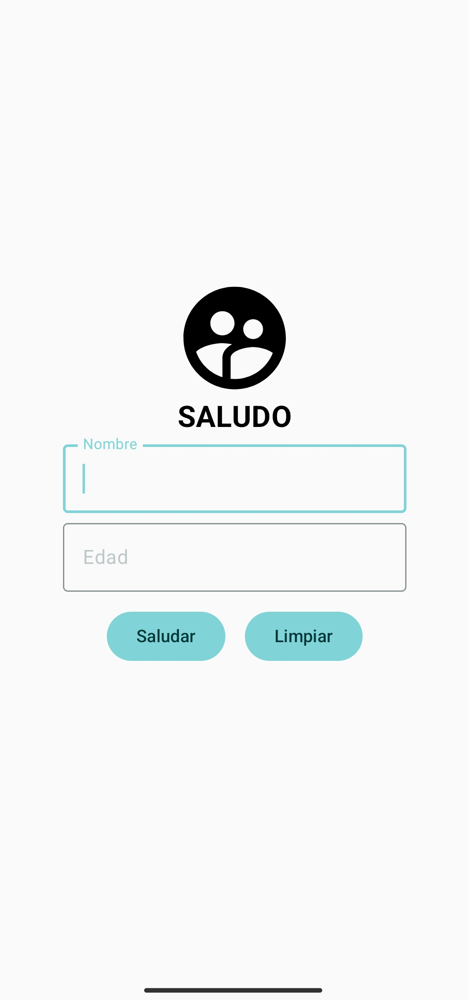
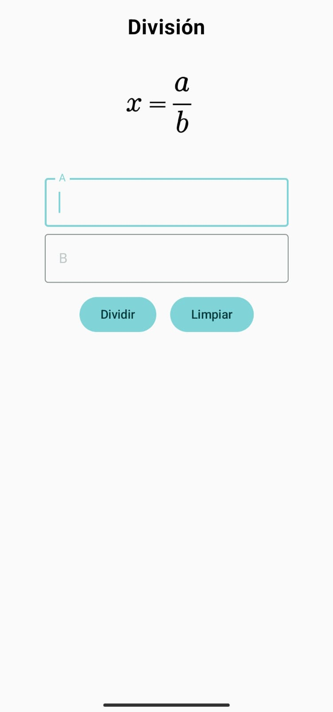

  

  <h1>Desarrollo de aplicaciones moviles</h1>

  
Con Android Studio y kotlin

# 🎨 Vista previa 

## <a href="#states">1. States</a>

  
Haz clic para ver la imagen

  

    
  

## <a href="#greeting">2. Greeting</a>

  
Haz clic para ver la imagen

  

    
  

## <a href="#division">3. Division</a>

  
Haz clic para ver la imagen

  

    
  

